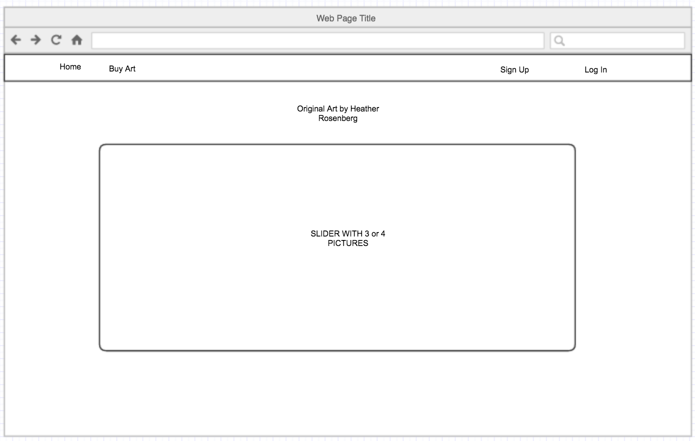

#Artwork and Shop by Heather Rosenberg

## Overview:

This app showcases the artwork of Heather Rosenberg and includes the opportunity to purchase the art(checkout button is not functional at this point). There is a page for photography and a page for fine art. The photography page allows you to go to a show page for each piece where you are able to magnify the piece. The app comes with user athorization and authentication.

##Technologies Used:

- Languages - HTML5, CSS3, Javascript, Angular Full-Stack Generator, Git, Github, Node.js and npm, Bower, Gulp, MongoDB, Express
- Design - Google Fonts, Gliffy (wireframe), Adobe Photoshop
- Project Planning & User Stories - [Trello](https://trello.com/b/Il9Z7qCh/project4)
- Sublime Text 3

##Wireframes:

##Future Developments:

- Integrate Stripe API and Paypal
- Push to Heroku
- Add a show page from Fine Art main page
- Add a comments section on the show pages
